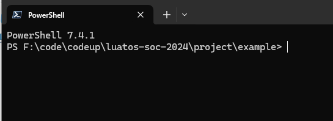
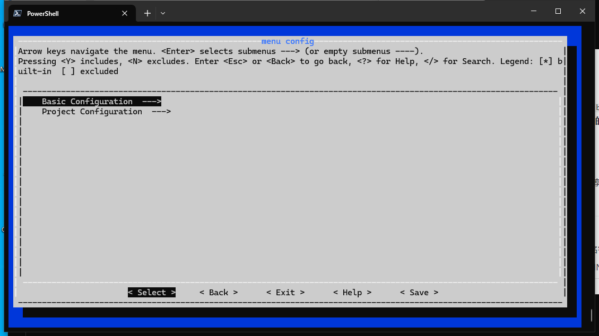
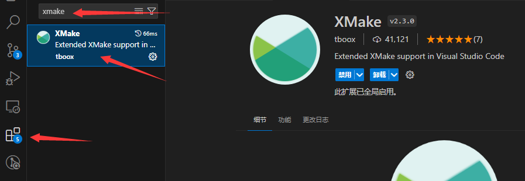

@[TOC]
# CSDK for ABCDEGF

[](https://github.com/openLuat/luatos-soc-2024/actions/workflows/ci.yaml)


**注意：CSDK无技术支持，使用前详细阅读每一句话自行评估是否使用！！！**

**注意：CSDK无技术支持，使用前详细阅读每一句话自行评估是否使用！！！**

**注意：CSDK无技术支持，使用前详细阅读每一句话自行评估是否使用！！！**


**注意：不管之前有没有用过合宙其他仓库的CSDK，使用前请详细阅读本readme的每一句话，不要跳过！！！**

**注意：不管之前有没有用过合宙其他仓库的CSDK，使用前请详细阅读本readme的每一句话，不要跳过！！！**

**注意：不管之前有没有用过合宙其他仓库的CSDK，使用前请详细阅读本readme的每一句话，不要跳过！！！**


**注意：每次更新csdk代码和更新xmake之后都要进行全量编译，最直接的办法是直接删除掉对应项目下的build目录，之后重新进行编译**

**注意：每次更新csdk代码和更新xmake之后都要进行全量编译，最直接的办法是直接删除掉对应项目下的build目录，之后重新进行编译**

**注意：每次更新csdk代码和更新xmake之后都要进行全量编译，最直接的办法是直接删除掉对应项目下的build目录，之后重新进行编译**


**注意：对于之前使用luatos-soc-2022仓库开发的项目代码无法直接复制到luatos-soc-2024编译使用，查看本仓库project中各个demo的xmake.lua进行修改并参考主库csdk api进行修改才可使用！！！**

**注意：对于之前使用luatos-soc-2023仓库开发的项目代码可以直接复制到luatos-soc-2024编译使用，但编译脚本要进行修改，查看本仓库project中各个demo的xmake.lua进行修改才可使用！！！**

luatos-soc-2023迁移luatos-soc-2024文档请点击[这里](#section)跳转

## 使用前须知！！！

1. **强烈推荐使用git来下载本代码库**, 不会命令行操作git可以用 [tortoiseGit](https://tortoisegit.org/download/)
2. 本CSDK底层是没有AT指令的,不存在"调用某某AT指令"的情况
3. **由于依赖luatos主库，所以要在 luatos-soc-2024/xmake.lua中配置luatos仓库目录，默认luatos目录在luatos-soc-2024同级目录，文件夹名称必须是LuatOS, LuatOS, LuatOS, 即在luatos-soc-2024同级目录 clone [LuatOS](https://gitee.com/openLuat/LuatOS) 仓库即可，否则编译报错**
4. 本项目使用[xmake](https://xmake.io/#/zh-cn/)构建，就算不熟悉lua和构建也能直接上手使用，几乎不会在构建上花费您的时间，**但如需自定义的一些操作请先查看下相关api**
5. 请留意, 本代码库使用的GCC版本与 luatos-soc-2022 库是不一样的, 无法更换,**同样由于lto原因也不要擅自更改编译工具链**
6. **不要在加密设备上运行！！！加密会产生各种奇怪的问题！**
7. 尽量使用win10/win11最新版本进行编译，**系统使用原版镜像，不要使用精简版！**

## 文档中心

* [CSDK软件开发资料](https://doc.openluat.com/wiki/37?wiki_page_id=4544)
* [差分工具及docker镜像](tools/dtools/README.md)

## 介绍
CSDK for ABCDEGF, 适用于所有基于ABCDEGF的合宙模组, 包括衍生型号及海外型号:

* Air780EP
* Air780ET
* Air780EL

## 目录说明

* PLAT 打包好的sdk, 含协议栈, 部分源码, 头文件, 打包工具
* project 项目文件, 每个不同的项目代表不同的demo或者turnkey方案
* xmake.lua 主编译脚本, 一般不需要修改

## 编译说明

​	安装xmake, **Windows安装时注意选取加入PATH**. 
xmake下载地址：https://github.com/xmake-io/xmake/releases
windows下载系统对应的xmake-x.x.x-win32.exe或者xmake-x.x.x-win64.exe安装即可. 建议使用最新版.

**注意：环境变量需重启电脑生效**

**注意：如果网络无法下载github等地址，采用下面的本地地址下载，后续更新xmake也会同步更新下方地址！！！**

本地下载地址: https://pan.air32.cn/s/DJTr?path=%2F%E5%B8%B8%E7%94%A8%E5%B7%A5%E5%85%B7

linux和macos安装请自行参考,但并不建议,因为macos无法打包,并且Luatools只支持windows
安装教程: https://xmake.io/#/guide/installation

### 编译操作

示例环境使用windows，linux/macosx 实际上也是通用的编译方式

在项目下打开终端，比如example,就在luatos-soc-2024\project\example下打开终端,即



首先执行配置，执行 `xmake f --menu`



`Basic Configuration` 我们不用去管，里面是编译架构/编译器相关配置，项目中会自动配置好交叉编译器，这里我们忽略，选择 `Project Configuration` 根据自己实际使用配置即可

配置完成选择Exit退出，询问是否保存选择yes

**注意:上述配置操作只需要配置一次，之后会一直生效，只有修改配置才需要重新执行配置操作**

随后执行 `xmake`进行编译即可，生成的binpkg/soc/日志数据库(comdb.txt)等文件都位于项目下`out`目录


ps：如果不想使用图形也支持使用命令行配置方式，例如`xmake f --chip_target=ec718p --lspd_mode=y --denoise_force=n` ，具体支持的配置项和参数执行 `xmake f --help` 查看 `Command options (Project Configuration)`下具体描述


### 清理编译

执行 `xmake clean -a`可以清除编译产生的中间文件(通常执行此命令即可)

执行 `xmake f -c`可以清除自己的配置(清除后需要重新执行上述配置)


### 加入自己的项目

​	仿照着example即可，项目可以放在任意目录下，其他盘符也没问题，不需要放在luatos-soc-2024目录下，只需要在自己项目的xmake.lua中配置好 `csdk_root` 路径即可 **注意:路径不要有中文，空格等特殊符号！！！**


### xmake插件(可选)

上面的文档已经有了完整编译过程，此处插件说明为可选，目的为更方便使用编译，如不需要可跳过看下面

在vscode扩展中安装xmake



之后编写xmake.lua就有代码联想了，并且可以提示错误,并且可以在vscode中直接一键编译


非常方便

### 加入入口函数

* 加入头文件common_api.h
* 类似于`void main(void)`，但是可以任意名字，不能有入口参数和返回参数，同时允许多个入口
* 通过INIT_HW_EXPORT INIT_DRV_EXPORT INIT_TASK_EXPORT这3个宏修饰后，系统初始化的时候会调用function，不同的宏涉及到调用顺序不同
* 大优先级上`INIT_HW_EXPORT` > `INIT_DRV_EXPORT` > `INIT_TASK_EXPORT`
* 这3个宏有统一用法`INIT_HW_EXPORT(function, level)`，其中function就是入口函数，level是小优先级，填"0","1","2"...(引号要写的)，引号里数字越小，优先级越高。

* `INIT_HW_EXPORT`一般用于硬件初始化，GPIO之类的，可以没有
* `INIT_DRV_EXPORT`一般用于外设驱动初始化，初始化外部器件之类的，打开电源，提供时钟之类的，可以没有
* `INIT_TASK_EXPORT`一般用于初始化任务，用户代码基本上都是跑在任务里，原则上必须有


## luatos-soc-2023迁移luatos-soc-2024

<a id="section"></a>

luatos-soc-2023迁移luatos-soc-2024主要有两点：

### 1，项目xmake.lua改动

这里我们直接以example_audio_flash为例，因为它覆盖较全：

```lua
local TARGET_NAME = os.scriptdir():match(".+[/\\]([%w_]+)")
local LIB_DIR = "$(buildir)/".. TARGET_NAME .. "/"

target(TARGET_NAME)
    set_kind("static")
    set_targetdir(LIB_DIR)

    --加入代码和头文件
    add_includedirs("./inc",{public = true})
    add_files("./src/*.c",{public = true})
    add_defines("LUAT_USE_SFUD",{public = true})

    --sfud
    add_includedirs(LUATOS_ROOT.."/components/sfud",{public = true})
    add_files(LUATOS_ROOT.."/components/sfud/*.c")
    remove_files(LUATOS_ROOT.."/components/sfud/luat_lib_sfud.c")

    add_linkdirs("$(projectdir)/lib","$(projectdir)/PLAT/core/lib",{public = true})
    -- 此处使用 libaisound50_16K.a, 还可选择 8K版本:libaisound50_8K.a,8K英文版本:libaisound50_8K_eng.a,16K英文版本:libaisound50_16K_eng.a
    add_linkgroups("tts_res", "aisound50_16K", {whole = true,public = true})
-- 
target_end()
```

前两行直接替换为

```lua
project_dir = os.scriptdir()
project_name = project_dir:match(".+[/\\]([%w_]+)")
```

并添加

```
csdk_root = "../../" --csdk根目录,可自行修改
includes(csdk_root.."csdk.lua")
description_common()
```

`set_targetdir(LIB_DIR)`修改为 `set_targetdir("$(buildir)/".. project_name .. "/")` 并添加`description_csdk()`

后面都为变量修改，`TARGET_NAME`修改为`project_name`， `LUATOS_ROOT`替换为`luatos_root`，修改原因为注意这不算通用全局变量，因为脚本域不可用，一定注意

由于项目路径修改，`$(projectdir)` 需改为 `csdk_root`

至此修改结束，修改后为

```lua
project_dir = os.scriptdir()
project_name = project_dir:match(".+[/\\]([%w_]+)")

csdk_root = "../../" --csdk根目录,可自行修改
includes(csdk_root.."csdk.lua")
description_common()

target(project_name,function()
    set_kind("static")
    set_targetdir("$(buildir)/".. project_name .. "/")
    description_csdk()
    set_warnings("error")

    --加入代码和头文件
    add_includedirs("./inc",{public = true})
    add_files("./src/*.c",{public = true})
    add_defines("LUAT_USE_SFUD",{public = true})

    --sfud
    add_includedirs(luatos_root.."/components/sfud",{public = true})
    add_files(luatos_root.."/components/sfud/*.c")
    remove_files(luatos_root.."/components/sfud/luat_lib_sfud.c")

    add_linkdirs(csdk_root.."/lib",csdk_root.."/PLAT/core/lib",{public = true})
    -- 此处使用 libaisound50_16K.a, 还可选择 8K版本:libaisound50_8K.a,8K英文版本:libaisound50_8K_eng.a,16K英文版本:libaisound50_16K_eng.a
    add_linkgroups("tts_res", "aisound50_16K", {whole = true,public = true})
-- 
end)
```


### 2，编译方式改动

之前为 build.bat 方式编译，这种方式并不跨平台，并且之前仓库一直引入环境变量也需要去掉，新的编译方式

编译直接执行xmake即可，并且跨平台，还可以在vscode中直接一键编译，非常方便


如果还是想使用2023仓库的build.bat方式编译，这里提供个兼容脚本

```shell
@echo off
set PROJECT_NAME=example
set LSPD_MODE=enable
set DENOISE_FORCE=disable
set CHIP_TARGET=ec718p

if not "%1"=="" (
	set PROJECT_NAME=%1
)

if not "%2"=="" (
	set LSPD_MODE=%2
) else (
	if "%1" == "luatos" (
		set LSPD_MODE=enable
	) else (
		@echo LSPD_MODE not set
	)
)

if not "%4"=="" (
	set CHIP_TARGET=%4
)

if not "%5"=="" (
	set DENOISE_FORCE=%5
)

if %LSPD_MODE% == "enable" (
    set LSPD_MODE=true
) else (
    set LSPD_MODE=false
)

if %DENOISE_FORCE% == "disable" (
    set DENOISE_FORCE=false
) else (
    set DENOISE_FORCE=true
)

@echo "=============================="
@echo "AirM2M https://openluat.com"
@echo "=============================="
@echo PROJECT   : %PROJECT_NAME%  
@echo CHIP_TARGET : %CHIP_TARGET%  
@echo LSPD_MODE : %LSPD_MODE%  
@echo DENOISE_FORCE : %DENOISE_FORCE%  
@echo "=============================="

cd project/%PROJECT_NAME% 
xmake f --chip_target=%CHIP_TARGET% --lspd_mode=%LSPD_MODE% --denoise_force=%DENOISE_FORCE%
if "%3"=="-v" (
	xmake -v
) else (
	xmake
)
cd ../../
pause
```

命名为build.bat放在luatos-soc-2024目录下，使用方法和2023一样，但是编译资源生成路径依然有变化，参考前面的编译文档


## 常见问题:

1，xmake包默认安装c盘，我c盘空间不多不想安装在c盘

答: 设置相关目录到其他盘
`xmake g --pkg_installdir="xxx"` 设置包安装目录 
`xmake g --pkg_cachedir="xxx"` 设置包缓存目录

2，我电脑无法联网，如何下载安装包？

答:可以提前准备好包，这里以windows环境安装本仓库gcc交叉编译工具链为例

首先下载好gcc-arm-none-eabi-10-2020-q4-major-win32.zip到D盘根目录，执行 `xmake g --pkg_searchdirs="D:"`xmake会优先搜索设置的目录去搜索安装包，就不必联网了

gcc下载连接参考 csdk.lua中的连接，选择对应平台下载

3，github包是否可以加速？

答:`xmake g --proxy_pac=github_mirror.lua`可设置内置的github加速镜像

4，更新xmake时候windows报毒怎么办？

答:xmake是完全开源的，可以放心使用，误报手动允许即可

5，更新xmake后使用遇到

```powershell
PS F:\luatos-soc-2024\project\luatos> xmake f --menu
checking for Microsoft Visual Studio (x64) version ... 2022
updating repositoerror: Updating 2c9ad29..695dd08
ke-mirror/build-artifacts
 * branch            main       -> FETCH_HEAD
error: Your local changes to the following files would be overwritten by merge:
        packages/xxx
Please commit your changes or stash them before you merge.
Aborting
```

报错怎么办

答:最直接的方式是删除  %localappdata%/.xmake/repositories (通常为 C:\Users\用户名\AppData\Local\\.xmake\repositories) 之后重新执行即可

更多问题可自己看[xmake](https://xmake.io/#/)文档


## 授权协议

[MIT License](LICENSE)
